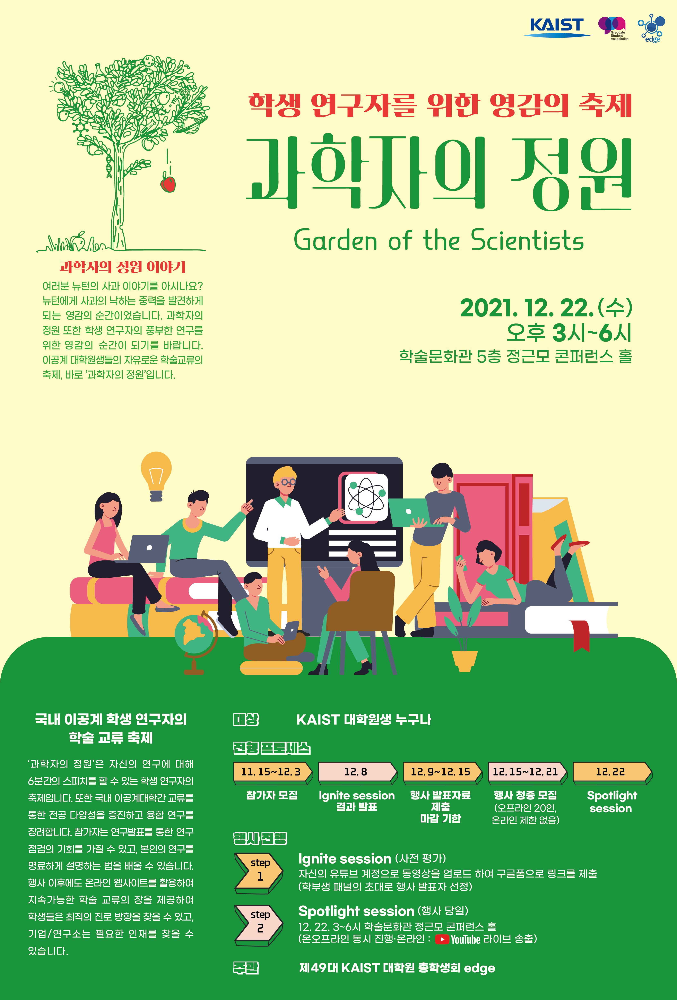

카이스트 협동조합 2021년 하반기 취미/체육강좌사업 사업보고서
===

## 공식 사업명
- 2021년 하반기 취미/체육강좌 사업

## 담당자
- 카이스트 협동조합 이사장

## 추진 배경
- 카이스트 학생들 대부분이 좁은 범위의 취미 생활과 문화 활동을 진행하고 있으며, 진행하는 활동의 경우에도 교외 지역에 비싼 가격을 주고 외부 교육 또는 활동을 하고있는 경우가 많이 있음.
- 동아리 또는 단체 활동에서 제공하기 어려운 수준의 교육이 필요한 취미 체육 강좌에 대한 수요가 끊임 없이 증가하고 있음.
- 학생들의 의견을 수렴하여 다양한 취미, 문화 강좌를 개설하고, 취미, 문화 강좌를 진행할 수 있는 공간 확보 및 편의 시설 확충이 필요함.

## 사업 목표
- 연구실 또는 기숙사를 오가는 카이스트 학생들에게 저렴한 가격으로 높은 수준의 문화 생활이 가능하도록 다양한 취미 체육 강좌를 제공하고, 학생들이 필요로 하는 강좌를 개설하고자 함.

## 일시
- 상시.

## 장소
- 서측회관 지하 무예실, 서측회관 3층 세미나실, 서측회관 기혼자자치회실, 서측 기숙사 마실 영화관 (코로나-19 유행 종료 시).

## 사업 진행 결과
- 체육 강좌: 요가, 필라테스 강좌
  - 2021년 12월부터 강좌 재개강

<table cellpadding="0" cellspacing="0" class="t1">
    <tbody>
        <tr>
            <td class="td1" valign="middle">
                
강좌

            </td>
            <td class="td1" valign="middle">
                
월

            </td>
            <td class="td1" valign="middle">
                
총 수강인원(중복수강 포함)

            </td>
        </tr>
        <tr>
            <td class="td1" rowspan="2" valign="middle">
                
요가

            </td>
            <td class="td1" valign="middle">
                
12월

            </td>
            <td class="td1" valign="middle">
                
39

            </td>
        </tr>
        <tr>
            <td class="td1" valign="middle">
                
1월

            </td>
            <td class="td1" valign="middle">
                
52

            </td>
        </tr>
        <tr>
            <td class="td1" rowspan="2" valign="middle">
                
필라테스

            </td>
            <td class="td1" valign="middle">
                
12월

            </td>
            <td class="td1" valign="middle">
                
88

            </td>
        </tr>
        <tr>
            <td class="td1" valign="middle">
                
1월

            </td>
            <td class="td1" valign="middle">
                
113

            </td>
        </tr>
        <tr>
            <td class="td1" rowspan="2" valign="middle">
                
발레

            </td>
            <td class="td1" valign="middle">
                
12월

            </td>
            <td class="td1" valign="middle">
                
8

            </td>
        </tr>
        <tr>
            <td class="td1" valign="middle">
                
1월

            </td>
            <td class="td1" valign="middle">
                
9

            </td>
        </tr>
    </tbody>
</table>

## 결산: 총 예산 9,930,000 원 중 6,122,300 원 집행
- 일반회계: 2,000,000 원 중 2,000,000 원 집행
- 학생회계: 7,930,000 원 중 4,122,300 원 집행 

| **내용** | **단가** | **수량** | **예산** | **결산** | **회계구분** |
|:---:|:---:|:---:|:---:|:---:|:---:|
| 웹사이트 유지보수비 | 1,000,000 | 1 | 1,000,000 | 1,000,000 | 학생회계 |
| 웹사이트 유지보수비 | 2,000,000 | 1 | 2,000,000 | 2,000,000 | 일반회계 |
| 참가자 기념품 제작 | 3,000,000 | 1 | 3,000,000 | 1,862,300 | 학생회계 |
| 스태프 수당 (9천원X10시간X15인) | 90,000 | 15 | 1,350,000 | 1,080,000 | 학생회계 |
| 예비비 | 2,400,000 | 1 | 2,400,000 | 0 | 학생회계 |
| 웹사이트 영문 번역 | 180,000 | 1 | 180,000 | 180,000 | 학생회계 |
| **사업비 총액** |  | | **9,930,000** | **6,122,300** |  |
| **일반회계 총액** |  | | **2,000,000** | **2,000,000** |  |
| **학생회계 총액** |  | | **7,930,000** | **4,122,300** |  |

## 사진

## 경품 수여자
- 없음.
