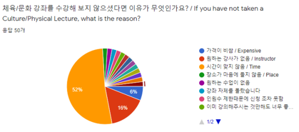

카이스트 협동조합 2021년 하반기 취미/체육강좌사업 사업보고서
===

## 공식 사업명
- 2021년 하반기 취미/체육강좌 사업

## 담당자
- 카이스트 협동조합 이사장

## 추진 배경
- 카이스트 학생들 대부분이 좁은 범위의 취미 생활과 문화 활동을 진행하고 있으며, 진행하는 활동의 경우에도 교외 지역에 비싼 가격을 주고 외부 교육 또는 활동을 하고있는 경우가 많이 있음.
- 동아리 또는 단체 활동에서 제공하기 어려운 수준의 교육이 필요한 취미 체육 강좌에 대한 수요가 끊임 없이 증가하고 있음.
- 학생들의 의견을 수렴하여 다양한 취미, 문화 강좌를 개설하고, 취미, 문화 강좌를 진행할 수 있는 공간 확보 및 편의 시설 확충이 필요함.

## 사업 목표
- 연구실 또는 기숙사를 오가는 카이스트 학생들에게 저렴한 가격으로 높은 수준의 문화 생활이 가능하도록 다양한 취미 체육 강좌를 제공하고, 학생들이 필요로 하는 강좌를 개설하고자 함.

## 일시
- 상시.

## 장소
- 서측회관 지하 무예실, 서측회관 3층 세미나실, 서측회관 기혼자자치회실, 서측 기숙사 마실 영화관 (코로나-19 유행 종료 시).

## 사업 진행 결과
- 체육 강좌: 요가, 필라테스 강좌
  - 2021년 12월부터 강좌 재개강

<table cellpadding="0" cellspacing="0" class="t1">
    <tbody>
        <tr>
            <td class="td1" valign="middle">
                
강좌

            </td>
            <td class="td1" valign="middle">
                
월

            </td>
            <td class="td1" valign="middle">
                
총 수강인원(중복수강 포함)

            </td>
        </tr>
        <tr>
            <td class="td1" rowspan="2" valign="middle">
                
요가

            </td>
            <td class="td1" valign="middle">
                
12월

            </td>
            <td class="td1" valign="middle">
                
39

            </td>
        </tr>
        <tr>
            <td class="td1" valign="middle">
                
1월

            </td>
            <td class="td1" valign="middle">
                
52

            </td>
        </tr>
        <tr>
            <td class="td1" rowspan="2" valign="middle">
                
필라테스

            </td>
            <td class="td1" valign="middle">
                
12월

            </td>
            <td class="td1" valign="middle">
                
88

            </td>
        </tr>
        <tr>
            <td class="td1" valign="middle">
                
1월

            </td>
            <td class="td1" valign="middle">
                
113

            </td>
        </tr>
        <tr>
            <td class="td1" rowspan="2" valign="middle">
                
발레

            </td>
            <td class="td1" valign="middle">
                
12월

            </td>
            <td class="td1" valign="middle">
                
8

            </td>
        </tr>
        <tr>
            <td class="td1" valign="middle">
                
1월

            </td>
            <td class="td1" valign="middle">
                
9

            </td>
        </tr>
    </tbody>
</table>

- 만족도 조사 결과 (내년 운영에 참고할 예정)

## 결산: 총 예산 450,000원 중 50,000원 집행 
   - 일반회계:  0원 중 0원 집행 
   - 학생회계:  450,000원 중 50,000원 집행

<table cellpadding="0" cellspacing="0" class="t1">
    <tbody>
        <tr>
            <td class="td1" valign="middle">
                
<strong>내용</strong>

            </td>
            <td class="td2" valign="middle">
                
<strong>단가</strong>

            </td>
            <td class="td2" valign="middle">
                
<strong>수량</strong>

            </td>
            <td class="td2" valign="middle">
                
<strong>예산</strong>

            </td>
            <td class="td2" valign="middle">
                
<strong>결산</strong>

            </td>
            <td class="td3" valign="middle">
                
<strong>회계구분</strong>

            </td>
        </tr>
        <tr>
            <td class="td4" valign="middle">
                
회의비

                <ul class="ul1">
                    <li class="li3">신규 강좌사업 추진 회의비</li>
                </ul>
            </td>
            <td class="td5" valign="middle">
                
100,000

            </td>
            <td class="td5" valign="middle">
                
1

            </td>
            <td class="td5" valign="middle">
                
100,000

            </td>
            <td class="td5" valign="middle">
                
-

            </td>
            <td class="td6" valign="middle">
                
학생회계

            </td>
        </tr>
        <tr>
            <td class="td7" valign="middle">
                
강좌 운영비

                <ul class="ul1">
                    <li class="li3">취미/체육강좌 관련 기구 및 도구비</li>
                </ul>
            </td>
            <td class="td8" valign="middle">
                
150,000

            </td>
            <td class="td8" valign="middle">
                
1

            </td>
            <td class="td8" valign="middle">
                
150,000

            </td>
            <td class="td8" valign="middle">
                
-

            </td>
            <td class="td9" valign="middle">
                
학생회계

            </td>
        </tr>
        <tr>
            <td class="td7" valign="middle">
                
강좌 운영비

                <ul class="ul1">
                    <li class="li3">강의실 청소 도구 및 환경 개선 장비</li>
                </ul>
            </td>
            <td class="td8" valign="middle">
                
150,000

            </td>
            <td class="td8" valign="middle">
                
1

            </td>
            <td class="td8" valign="middle">
                
150,000

            </td>
            <td class="td8" valign="middle">
                
-

            </td>
            <td class="td9" valign="middle">
                
학생회계

            </td>
        </tr>
        <tr>
            <td class="td7" valign="middle">
                
만족도 조사비

                
- 설문조사 경품

            </td>
            <td class="td8" valign="middle">
                
50,000

            </td>
            <td class="td8" valign="middle">
                
1

            </td>
            <td class="td8" valign="middle">
                
50,000

            </td>
            <td class="td8" valign="middle">
                
50,000

            </td>
            <td class="td9" valign="middle">
                
학생회계

            </td>
        </tr>
        <tr>
            <td class="td10" valign="middle">
                
<strong>사업비 총액</strong>

            </td>
            <td class="td11" valign="middle">
                
 

            </td>
            <td class="td11" valign="middle">
                
 

            </td>
            <td class="td11" valign="middle">
                
<strong>450,000</strong>

            </td>
            <td class="td11" valign="middle">
                
<strong>50,000</strong>

            </td>
            <td class="td12" valign="middle">
                
 

            </td>
        </tr>
        <tr>
            <td class="td13" valign="middle">
                
일반회계 총액

            </td>
            <td class="td14" valign="middle">
                
 

            </td>
            <td class="td14" valign="middle">
                
 

            </td>
            <td class="td14" valign="middle">
                
-

            </td>
            <td class="td14" valign="middle">
                
-

            </td>
            <td class="td15" valign="middle">
                
 

            </td>
        </tr>
        <tr>
            <td class="td16" valign="middle">
                
학생회계 총액

            </td>
            <td class="td17" valign="middle">
                
 

            </td>
            <td class="td17" valign="middle">
                
 

            </td>
            <td class="td17" valign="middle">
                
450,000

            </td>
            <td class="td17" valign="middle">
                
50,000

            </td>
            <td class="td18" valign="middle">
                
 

            </td>
        </tr>
    </tbody>
</table>

## 경품 수여자
- 만족도 조사 경품.

<table cellpadding="0" cellspacing="0" class="t1">
    <tbody>
        <tr>
            <td class="td1" valign="middle">
                
<strong>번호</strong>

            </td>
            <td class="td1" valign="middle">
                
<strong>학번(사번)</strong>

            </td>
            <td class="td1" valign="middle">
                
<strong>성명</strong>

            </td>
            <td class="td1" valign="middle">
                
<strong>연락처</strong>

            </td>
            <td class="td1" valign="middle">
                
<strong>경품</strong>

            </td>
        </tr>
        <tr>
            <td class="td1" valign="middle">
                
1

            </td>
            <td class="td1" valign="middle">
                
202004**

            </td>
            <td class="td1" valign="middle">
                
-

            </td>
            <td class="td1" valign="middle">
                
is**@kaist.ac.kr

            </td>
            <td class="td1" valign="middle">
                
문화상품권 1만원권

            </td>
        </tr>
        <tr>
            <td class="td1" valign="middle">
                
2

            </td>
            <td class="td1" valign="middle">
                
201852**

            </td>
            <td class="td1" valign="middle">
                
-

            </td>
            <td class="td1" valign="middle">
                
sk**@kaist.ac.kr

            </td>
            <td class="td1" valign="middle">
                
문화상품권 1만원권

            </td>
        </tr>
        <tr>
            <td class="td1" valign="middle">
                
3

            </td>
            <td class="td1" valign="middle">
                
202134**

            </td>
            <td class="td1" valign="middle">
                
-

            </td>
            <td class="td1" valign="middle">
                
je**@kaist.ac.kr

            </td>
            <td class="td1" valign="middle">
                
문화상품권 1만원권

            </td>
        </tr>
        <tr>
            <td class="td1" valign="middle">
                
4

            </td>
            <td class="td1" valign="middle">
                
201950**

            </td>
            <td class="td1" valign="middle">
                
-

            </td>
            <td class="td1" valign="middle">
                
ji**@kaist.ac.kr

            </td>
            <td class="td1" valign="middle">
                
문화상품권 1만원권

            </td>
        </tr>
        <tr>
            <td class="td1" valign="middle">
                
5

            </td>
            <td class="td1" valign="middle">
                
202050**

            </td>
            <td class="td1" valign="middle">
                
-

            </td>
            <td class="td1" valign="middle">
                
ks**@kaist.ac.kr

            </td>
            <td class="td1" valign="middle">
                
문화상품권 1만원권

            </td>
        </tr>
        <tr>
            <td class="td1" valign="middle">
                
6

            </td>
            <td class="td1" valign="middle">
                
201781**

            </td>
            <td class="td1" valign="middle">
                
-

            </td>
            <td class="td1" valign="middle">
                
mi**@kaist.ac.kr

            </td>
            <td class="td1" valign="middle">
                
문화상품권 1만원권

            </td>
        </tr>
        <tr>
            <td class="td1" valign="middle">
                
7

            </td>
            <td class="td1" valign="middle">
                
201852**

            </td>
            <td class="td1" valign="middle">
                
-

            </td>
            <td class="td1" valign="middle">
                
lh**@kaist.ac.kr

            </td>
            <td class="td1" valign="middle">
                
문화상품권 1만원권

            </td>
        </tr>
        <tr>
            <td class="td1" valign="middle">
                
8

            </td>
            <td class="td1" valign="middle">
                
201901**

            </td>
            <td class="td1" valign="middle">
                
-

            </td>
            <td class="td1" valign="middle">
                
zo**@kaist.ac.kr

            </td>
            <td class="td1" valign="middle">
                
문화상품권 1만원권

            </td>
        </tr>
        <tr>
            <td class="td1" valign="middle">
                
9

            </td>
            <td class="td1" valign="middle">
                
202032**

            </td>
            <td class="td1" valign="middle">
                
-

            </td>
            <td class="td1" valign="middle">
                
jo**@kaist.ac.kr

            </td>
            <td class="td1" valign="middle">
                
문화상품권 1만원권

            </td>
        </tr>
        <tr>
            <td class="td1" valign="middle">
                
10

            </td>
            <td class="td1" valign="middle">
                
201804*8

            </td>
            <td class="td1" valign="middle">
                
-

            </td>
            <td class="td1" valign="middle">
                
yl**@kaist.ac.kr

            </td>
            <td class="td1" valign="middle">
                
문화상품권 1만원권

            </td>
        </tr>
    </tbody>
</table>
